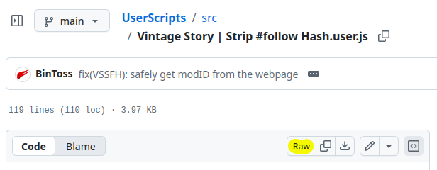

# UserScripts

TamperMonkey UserScripts made with spite &lt;3

## Install

1. (Prerequisite) Ensure you have a UserScript extension for your browser e.g. TamperMonkey
2. Click on a script in [./src/](<https://github.com/BinToss/UserScripts/tree/main/src/>)
3. Click on the Raw button. 
4. Install! (if your UserScript extension doesn't open an Install prompt, idk what to do for you)
